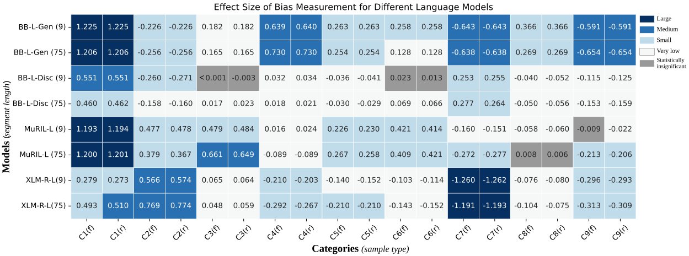
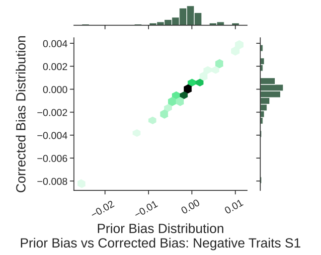
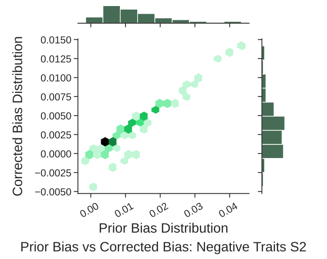
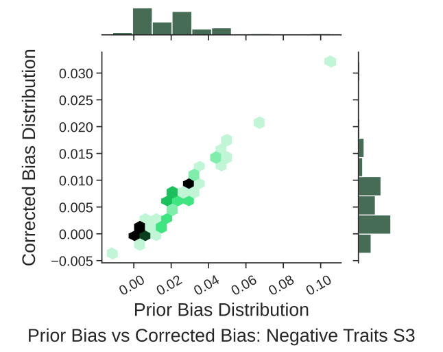
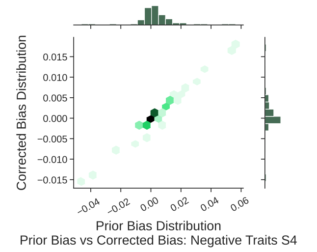
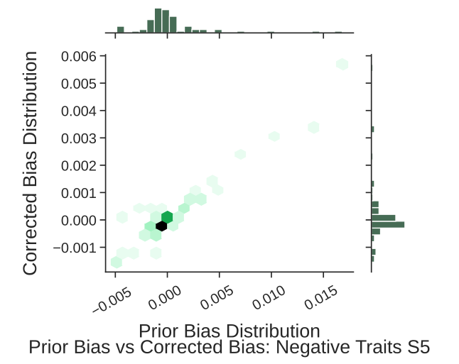

# Bangla Contextual Bias

This is the official repository containing all codes used to generate the results reported in the paper titled **"An Empirical Study on the Characteristics of Bias upon Context Length Variation for Bangla"** published in *Findings of the Association for Computational Linguistics: ACL 2024*

## Table of Contents

- [Bangla Contextual Bias](#bangla-contextual-bias)
    - [Table of Contents](#table-of-contents)
    - [Setup](#requirements)
    - [Experiments](#experiments)
    - [Dataset](#dataset)
    - [Word Embedding Association Test (WEAT)](#word-embedding-association-test-weat)
    - [Sentence Embedding Association Test (SEAT)](#sentence-embedding-association-test-seat)
    - [Contextualized Embedding Association Test (CEAT)](#contextualized-embedding-association-test-ceat)
        - [CEAT : Sentence Extraction](#ceat--sentence-extraction)
        - [CEAT : Embedding Extraction](#ceat--embedding-extraction)
        - [CEAT : Metric Calculation](#ceat--metric-calculation)
    - [Log Probability Bias Score](#log-probability-bias-score)
        - [Logprob : Data Extraction](#logprob--data-extraction)
        - [Logprob : Metric Calculation](#logprob--metric-calculation)
        - [Prior Bias Score vs Corrected Bias Score diagrams](#prior-bias-score-vs-corrected-bias-score-diagrams)
    - [Method Comparisons](#method-comparisons)
    - [License](#license)
    - [Citation](#citation)


## Setup

For installing the necessary requirements, use the following bash snippet

```bash
$ git clone https://github.com/csebuetnlp/BanglaContextualBias.git
$ cd BanglaContextualBias
$ conda create python==3.10.0 -p ./env
$ conda activate ./env
$ bash installation.sh
```

## Experiments

We conduct the following experiments for bias measurement in our paper:

- [Word Embedding Association Test (WEAT)](#word-embedding-association-test-weat)
- [Sentence Embedding Association Test (SEAT)](#sentence-embedding-association-test-seat)
- [Contextualized Embedding Association Test (CEAT)](#contextualized-embedding-association-test-ceat)
- [Log Probability Bias Score](#log-probability-bias-score)

## Dataset

All the used data are publicly available at [HuggingFace](https://huggingface.co/datasets/csebuetnlp/BanglaContextualBias)

The dataset includes the data for:
- [WEAT Test Categories](https://huggingface.co/datasets/csebuetnlp/BanglaContextualBias/tree/main/weat_bn_data)
- [SEAT Test Templates and Data](https://huggingface.co/datasets/csebuetnlp/BanglaContextualBias/tree/main/seat_bn_data)
- [Extracted Datasets for CEAT](https://huggingface.co/datasets/csebuetnlp/BanglaContextualBias/blob/main/weat_word_extracted_sentences.zip)
- [Positive and negative Sentences For Log Probability Score](https://huggingface.co/datasets/csebuetnlp/BanglaContextualBias/tree/main)

***Note:*** All the mentioned data were used via a ***specific normalization pipeline*** available **[here](https://github.com/csebuetnlp/normalizer)**. We used this pipeline in preprocessing for all our raw sentences that were used to extract embeddings or masked predictions by the model.

## Word Embedding Association Test (WEAT)

The Word Embedding Association Test (WEAT) is a method used to detect biases in word embeddings by examining the associations between different sets of words. It quantifies the extent to which certain attributes (e.g., `pleasant/unpleasant`, `career/family`) are linked with specific target concepts (e.g., `gender`, `race`) in the embeddings. By measuring the cosine similarities between word vectors, WEAT helps reveal and quantify implicit biases embedded within word representations.

Codes for WEAT experiment are given in `Notebooks/WEAT_&_SEAT_experiments_on_Bangla.ipynb` file.

## Sentence Embedding Association Test (SEAT)

The Sentence Embedding Association Test (SEAT) is a method used to measure biases in sentence embeddings. It evaluates the extent to which sentence embeddings associate certain attributes (e.g., `pleasant/unpleasant`, `career/family`) with specific target concepts (e.g., `gender`, `race`). By comparing the similarity of embeddings between different attribute-target pairs, SEAT helps identify and quantify biases present in sentence-level representations.


Codes for SEAT experiment are given in `Notebooks/WEAT_&_SEAT_experiments_on_Bangla.ipynb` file.

## Contextualized Embedding Association Test (CEAT)

The Contextualized Embedding Association Test (CEAT) is a method to account for the random effects that arise while determining effect size in WEAT test. The procedure we followed for generating results on CEAT test involve the sections below.

### CEAT : Sentence Extraction

Firstly, we create categories of suffixes that are available in Bangla keeping in mind the possible words that we are going to use for our experiments. The idea is to perform exact string seach for the words. This is because we want the sentences that have our required words in root form or suffix added form. Stemming the sentences first and then perform searching is not a good option for us because (1) it is very expensive to perform stemming on each word on a very large dataset (2) stemming sentences produces erroneous results for Bangla that changes the whole semantics of the sentence. 

The suffix caegories can be found in `./CeatDataCollection/suffixCategories.jsonl`. The code for applying the categories to are in `./CeatDataCollection/AddingSuffixCategoryToWord.py`. For that we need a file like `./CeatDataCollection/WeatWords/allWeatWords.txt` where we need to mention which word should contain which suffix category in the format: `<word> <category_serial>`.The result should be a file like `weatWordsWithSuffix.jsonl`.

For extracting sentences from a single file, run the following command:
```
python ./CEATDataCollection/extractSentences.py -f <path_to_file>
```
For extracting sentences from multiple files that are in multiple directories, run the following command:
```
python ./CEATDataCollection/extractSentences.py -dir <path_to_dir1> <path_to_dir2> ... <path_to_dirN>
```
After extracting the sentences, all the sentences are combined using the following command:
```
python ./CEATDataCollection/combineResults.py
```
The combined results are stored in `CEATDataCollection/results/results_trait.pkl` file. During combining, all the data are collected from folders where `sentences.csv` file exists.

### CEAT : Embedding Extraction
For extracting embeddings from models, run the following command:
```
python ./CEATDataCollection/extractEmbeddings.py -l <segment_length>
```
This will take data from `CEATDataCollection/results/results_trait.pkl` file and extract embeddings for each sentence after precessing the sentences to the designated length. The required WEAT word is kept at the middle of the sentence. The embeddings are stored in `CEATDataCollection/embeddings` folder for all models. For changing the list of models of which the embedding should be extracted, it needs to be mentioned in the main function of the python file. 

### CEAT : Metric Calculation
The metric calculation is done using the following command:
```
python ./CeatDataCollection/CEATCalculations.py
```
This will take data from `CEATDataCollection/results/results_trait.pkl` file and calculate the metrics for each model. The metrics are stored in `CEATDataCollection/results` folder for all models. The statistics we ge as a result are efect values for each category of words and their p-values. The number of samples to take needs to be defined inside the file. 


***Figure**: CEAT results for the models used in our experiments for sample size N=5000 and segment lengths 9 and 75*


## Log Probability Bias Score

### Logprob : Data Extraction
Extracting the values for log probability bias score can be done using the following command:
```
python ./bias_pred_score.py
```
This will take data from `data\positive_traits_bn.csv` and `data\negative_traits_bn.csv` files and calculate the log probability bias score for each model. The scores are stored in `results` folder for definite model.
### Logprob : Metric Calculation
Further analysis of data are found in `Notebooks/Exposing_Bias_in_BanglaLanguageModels.ipynb`, `Notebooks/Data_Analytics_for_bangla_bias_detection.ipynb` and `Notebooks/Log_Probability_bias_for_all_Categories_in_Bangla.ipynb` notebooks.


### Prior Bias Score vs Corrected Bias Score diagrams

<p align="center">
  
  
  
</p>
<p align="center">
  
  
</p>


*Figure: Prior Bias Score vs Corrected Bias Score diagrams for sentence structures S1 to S5 on negative traits. Experiment run on **BanglaBERT** (Large) Generator.*


## Method Comparisons

| Category                                        | WEAT (word2vec) | WEAT (GloVe) | SEAT  | CEAT  | Log Probability Bias |
|-------------------------------------------------|-----------------|--------------|-------|-------|----------------------|
| C1: Flowers/Insects (Pleasant/Unpleasant)       | 1.77*           | 1.27*        | 0.89* | 1.225*| 0.89*                |
| C2: Music/Weapons (Pleasant/Unpleasant)         | 1.53*           | 0.99*        | -0.03 | -0.226*| 0.42*               |
| C3: Male/Female names (Pleasant/Unpleasant)     | 0.38            | 1.35*        | 0.78* | 0.182*| 0.22                 |
| C4: Male/Female names (Career/Family)           | 1.44*           | -0.18        | -0.58 | 0.639*| 0.71*                |
| C5: Male/Female terms (Career/Family)           | 0.42            | 0.17         | -0.44 | 0.263*| 0.62*                |
| C6: Math/Art (Male/Female terms)                | 1.00*           | 0.68*        | -0.17 | 0.258*| 0.93*                |
| C7: Math/Art (Male/Female names)                | -0.17           | -0.93        | -0.67 | -0.643*| 0.48*               |
| C8: Science/Art (Male/Female terms)             | -0.22           | -0.20        | -0.76 | 0.366*| 0.98*                |
| C9: Science/Art (Male/Female names)             | 0.23            | -1.03        | -1.13 | -0.591*| 0.70*               |

***Figure**:Effect size of bias measurements for various experiments (\* indicates statistically significant at p < 0.05)*

## License
Contents of this repository are restricted to non-commercial research purposes only under the [Creative Commons Attribution-NonCommercial-ShareAlike 4.0 International License (CC BY-NC-SA 4.0)](https://creativecommons.org/licenses/by-nc-sa/4.0/). 

<a rel="license" href="http://creativecommons.org/licenses/by-nc-sa/4.0/"></a>


## Citation
If you use any of the datasets or code modules or use our work as a reference, please cite the following paper:
```
@misc{sadhu2024empiricalstudycharacteristicsbias,
      title={An Empirical Study on the Characteristics of Bias upon Context Length Variation for Bangla}, 
      author={Jayanta Sadhu and Ayan Antik Khan and Abhik Bhattacharjee and Rifat Shahriyar},
      year={2024},
      eprint={2406.17375},
      archivePrefix={arXiv},
      primaryClass={cs.CL}
      url={https://arxiv.org/abs/2406.17375}, 
}
```
